# **MODUL 1**
###### Table of Content
- ### [**Pengantar Database**](#1-pengantar-database)
    - [***Database***](#database)
    - [**DBMS**](#dbms-database-management-system)
    - [**SQL**](#sql)
    - [**Tipe Data pada MySQL**](#tipe-data-pada-mysql)
<br>

- ### [*Data Definition Language* (DDL)](#2-data-definition-language-(ddl))
    - [***CREATE***](#create)
    - [***ALTER***](#alter)
    - [***DROP***](#drop)
<br>

- ### [**Statement DDL pada *Database* MySQL**](#statement-ddl-pada-database-mysql)

- ### [***MySQL Constraint***](mysql-constraint)

- ### [***Referential Integrity Constraint***](referential-integrity-constraint)

---
## **Pengantar *Database***
- ### ***Database***
    <div align='justify'>
    &nbsp;&nbsp;&nbsp;Basis data (<i>database</i>) adalah suatu kumpulan data yang disusun dalam bentuk tabel-tabel yang saling berkaitan maupun berdiri sendiri dan disimpan secara bersama-sama pada suatu media. Basis data dapat digunakan oleh satu atau lebih program aplikasi secara optimal, data disimpan tanpa mengalami ketergantungan pada program yang akan menggunakannya.
    </div>

- ### DBMS (*Database Management System*)
    <div align='justify'>
    &nbsp;&nbsp;&nbsp;DBMS ini merupakan sebuah software atau sistem yang telah dirancang sedemikian rupa untuk dapat mengolah sebuah database dan menjalankan operasi terhadap data yang akan diminta oleh pengguna-penggunanya. Tujuan utama dari penggunaan DBMS ini yaitu untuk dapat menghindari kekacauan ketika kita ingin melakukan pengolahan data yang jumlah nya sangat besar.
    <br>
    <br>
    Contoh dari DBMS sendiri yaitu: 
    <br><ul><li>MySQL</li>
    <li>Microsoft Access</li> 
    <li>Airtable</li> 
    <li>Oracle</li> 
    <li>SQL Server</li>
    </div>

- ### SQL
    <div align='justify'>
    &nbsp;&nbsp;&nbsp;SQL (<i>Structured Query Language</i>) adalah bahasa komputer yang menjadi standar ANSI (<i>American National Standard Institute</i>) untuk mengakses dan memanipulasi data dalam basis data relasional.
    <br>
    <br>
    Fungsi SQL meliputi:
    <br>
    <b><ul><li>Menjalankan <i>query</i> dalam <i>database</i></b></li>
    SQL digunakan untuk menjalankan query atau perintah untuk mengambil data tertentu dari basis data relasional.
    <br>
    <br>
    <b><li>Memasukkan data ke dalam <i>database</i></b></li>
    SQL juga digunakan untuk memasukkan data baru ke dalam basis data relasional. Data baru dapat dimasukkan ke dalam tabel menggunakan perintah INSERT. 
    <br>
    <br>
    <b><li>Mengubah data dalam <i>database</i></b></li>
    SQL memungkinkan pengguna untuk mengubah data dalam basis data relasional dengan menggunakan perintah UPDATE. Perintah ini memungkinkan pengguna untuk mengubah nilai yang ada dalam kolom tabel.
    <br>
    <br>
    <b><li>Menghapus data dalam <i>database</i></b></li>
    SQL juga memungkinkan pengguna untuk menghapus data dalam basis data relasional dengan menggunakan perintah DELETE. Perintah ini memungkinkan pengguna untuk menghapus satu atau beberapa baris data dari tabel. </ul>
    <br>
    <p align="center">
    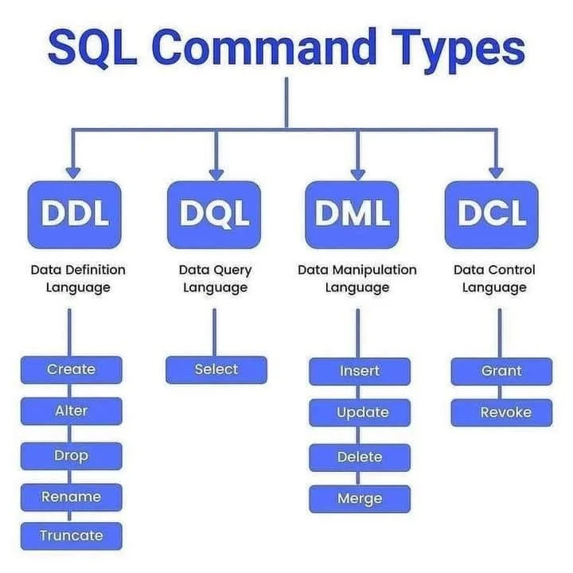
    <br>
    <i>SQL Command Types</i>
    </p>

    SQL menggunakan command atau perintah yang dapat dikelompokkan menjadi 4, yaitu:
    <br>
    <b><ul><li>DDL (<i>Data Definition Language</i>)</b></li>
    DDL digunakan untuk mendefinisikan atau mengelola objjek basis data seperti tabael, kolom, index, dan prosedur.
    <br>
    <br>
    <b><li>DML (<i>Data Manipulation Language</i>)</b></li>
    DML digunakan untuk memanipulasi data yang ada dalam basis data seperti menambah, mengubah, dan menghapus data. 
    <br>
    <br>
    <b><li>DCL (<i>Data Control Language</i>)</b></li>
    DCL digunakan untuk mengatur hak akses pengguna terhadap basis data seperti memberikan izin untuk membaca atau menulis pada tabel tertentu.
    <br>
    <br>
    <b><li>TCL (<i>Transaction Control Language</i>)</b></li>
    TCL digunakan untuk mengelola transaksi basis data seperti COMMIT (mengkonfirmasi transaksi) dan ROLLBACK (membatalkan transaksi).</ul>
    </div>
- ### Tipe Data pada MySQL
    <div align='justify'>
    &nbsp;&nbsp;&nbsp;Tipe data adalah suatu bentuk pemodelan data yang dideklarasikan pada saat melakukan pembuatan tabel. Tipe data ini akan mempengaruhi setiap data yang akan dimasukkan ke dalam sebuah tabel. Data yang akan dimasukkan harus sesuai dengan tipe data yang dideklarasikan. Berbagai tipe data pada MySQL dapat dilihat sebagai berikut :
    </div>
    <br>
    
    | Tipe Data        | Deskripsi    |
    | :------------- |:-------------|
    | `Char (size)`      | Mendefinisikan String sepanjang _size_ karakter. Bila _size_ tidak disertakan maka panjang karakter adalah 1. |
    | `Varchar (size)`    | Mendefinisikan String yang panjangnya berubah-ubah sesuai kebutuhan. Panjang maksimum karakter adalah 4000.|
    | `Int (size)` | Digunakan untuk menyimpan data bilangan bulat positif dan negatif. |
    | `Time`     | Digunakan untuk menyimpan nilai waktu dengan format jam, menit, dan detik dalam rentang waktu 00:00:00 hingga 23:59:59.  |
    | `Date` | Mendefinisikan tanggal. Tanggal yang bisa disimpan antara 1 Januari 4712 SM dan 31 Desember 9999 M.|
    | `Decimal (size, d)`      | Tipe data untuk menyimpan angka desimal dengan presisi tertentu. Parameter _size_ menentukan jumlah digit yang dapat disimpan, sedangkan parameter d menentukan jumlah digit yang ditempatkan setelah titik desimal.|
    | `Double` | Tipe data untuk menyimpan angka pecahan dengan presisi tinggi. Tipe data ini dapat menyimpan angka dengan jumlah digit yang lebih besar dibandingkan dengan tipe data FLOAT.|
    | `Float`      | Tipe data untuk menyimpan angka pecahan dengan presisi yang lebih rendah daripada tipe data DOUBLE.|
    | `Boolean/Tinyint(1)` | Tipe data yang digunakan untuk menyimpan nilai boolean atau logika (true/false). Tipe data ini merupakan varian dari tipe data Tinyint dengan panjang 1.|
    | `Text`      | Tipe data yang digunakan untuk menyimpan teks dengan panjang yang sangat besar. Tipe data ini dapat menyimpan teks dengan panjang hingga 65,535 karakter.|
    | `Blob` | Tipe data yang digunakan untuk menyimpan data biner dengan panjang yang sangat besar. Tipe data ini dapat menyimpan data biner dengan panjang hingga 65,535 byte. |

    ___
## 2. ***Data Definition Language* (DDL)**
<div align='justify'>
&nbsp;&nbsp;&nbsp;DDL atau <i>Data Definition Language</i> merupakan bahasa pemrograman SQL (<i>Structure Query Language</i>) yang mempunyai perintah untuk membuat dan memodifikasi struktur dari suatu objek dalam database yang utamanya berbentuk skema. Objek tersebut dapat berupa tabel, index, view, dan trigger. Fungsi utama DDL sebagai berikut : 
</div>

- **_CREATE_**
    <div align='justify'>
    &nbsp;&nbsp;&nbsp;Perintah <i>CREATE</i> digunakan untuk membuat objek baru, baik berupa database, tabel, indeks, atau prosedur yang tersimpan. Syntax dari perintah <i>CREATE</i> dapat bervariasi tergantung pada objek yang dibuat, tetapi umumnya sebagai berikut :
    <br>
    <br>
    </div>

    ```sql
	CREATE TABLE mahasiswa (
		id INT PRIMARY KEY,
		nama VARCHAR(50),
		jurusan VARCHAR(50),
		tanggal_lahir DATE,
	);
    ```
- **_ALTER_**
    <div align='justify'>
    &nbsp;&nbsp;&nbsp;Perintah <i>ALTER</i> digunakan untuk mengubah atau memodifikasi struktur tabel yang telah ada dalam database, dengan cara menambahkan, menghapus atau mengubah tipe data suatu kolom pada tabel, mengubah nama tabel, menambah dan menghapus index, atau menentukan <i>Primary Key</i> atau <i>Foreign Key</i>. Syntax perintah <i>ALTER</i> dapat bervariasi, tergantung pada objek yang ingin diubah. Namun, pada umumnya memiliki struktur sebagai berikut :
    <br>
    <br>
    </div>

    ```sql
    ALTER TABLE mahasiswa 
    ADD COLUMN email VARCHAR(50); 
    ```
- **_DROP_**
    <div align='justify'>
    &nbsp;&nbsp;&nbsp;Perintah <i>DROP</i> digunakan untuk menghapus atau menghilangkan objek pada database. Perintah <i>DROP</i> tidak bisa di undo, sehingga objek yang telah dihapus tidak bisa dikembalikan. Syntax pada perintah <i>DROP</i> umumnya sebagai berikut :
    <br>
    <br>
    </div>

    ```sql
    DROP TABLE mahasiswa;
    ```
---
## **Statement DDL pada *Database* MySQL**
- ### **Pembuatan *Database***
    - #### **CREATE DATABASE**
        <div align='justify'>
        Digunakan untuk membuat <i>database</i> dalam server MySQL dengan perintah :
        </div>
        <br>

        ```sql
        CREATE DATABASE nama_database;
        ```
        Contoh : 
        <p align="center">
        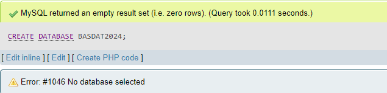
        </p>

    - #### **SHOW DATABASE**
        <div align='justify'>
        Digunakan untuk melihat seluruh <i>database</i> yang telah dibuat dengan perintah :
        </div>
        <br>

        ```sql
        SHOW DATABASES;
        ```
        Contoh : 
        <p align="center">
        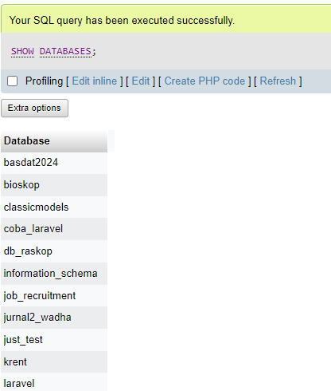
        </p>


    - #### **USE DATABASE**
        <div align='justify'>
        Digunakan untuk mengakses <i>database</i> yang telah dibuat. Perintah ini diperlukan saat kita akan menggunakan <i>database</i> tersebut dengan perintah :
        </div>
        <br>

        ```sql
        USE nama_database;
        ```

    - #### **CREATE TABLE**
        <div align='justify'>
        Digunakan untuk membuat tabel dalam sebuah <i>database</i> dengan perintah :
        </div>
        <br>

        ```sql
        CREATE TABLE nama_tabel(
            nama_kolom1 tipe_data null / not null primary key / not,
            nama_kolom2 tipe_data null / not null
        );
        ```
        Contoh : 
        <p align="center">
        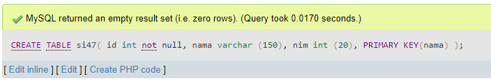
        </p>


    - #### **SHOW TABLE**
        <div align='justify'>
        Digunakan untuk melihat seluruh tabel yang telah dibuat sebelumnya. (Dengan syarat : Sudah berada di <i>database</i> yang mempunyai tabel tersebut) dengan perintah :
        </div>
        <br>

        ```sql
        SHOW TABLES;
        ```
        Contoh : 
        <p align="center">
        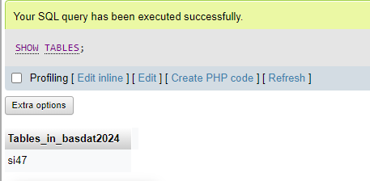
        </p>


    - #### **DESC TABLE**
        <div align='justify'>
        DESC merupakan singkatan dari <i>DESCRIBE</i>. DESC digunakan untuk mendeskripsikan struktur sebuah tabel dengan perintah : 
        </div>
        <br>

        ```sql
        DESC nama_tabel;
        ```
        Contoh : 
        <p align="center">
        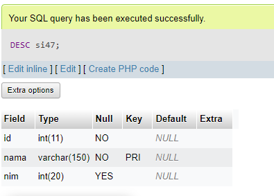
        </p>

        
    - #### **FOREIGN KEY**
        <div align='justify'>
        <i>Foreign Key</i> adalah sebuah <i>field</i> dalam satu tabel yang merujuk pada <i>Primary Key</i> di tabel lain. Tabel yang memiliki <i>Foreign Key</i> disebut sebagai <i>child table</i> (tabel anak), sedangkan tabel yang memiliki <i>Primary Key</i> disebut sebagai <i>parent table</i> (tabel induk) atau tabel yang dirujuk. <i>Foreign Key</i> berarti nilai dalam satu tabel bisa berkorelasi dengan tabel lain menggunakan id yang sama. <i>Foreign Key</i> atau FK merupakan sebuah integritas referensial dalam basis data. <br>Cara menggunakan <i>Foreign Key</i> adalah :
        </div>
        <br>

        ```sql
        CREATE TABLE nama_tabel(
            nama_kolom1 tipe_data not null primary key,
            nama_kolom2 tipe_data not null,
            CONSTRAINT fk_kolom
            FOREIGN KEY (kolom1, kolom2, …)
            REFERENCES nama_tabel_parent (kolom_parent)
        );
        ```
        Contoh : 
        <p align="center">
        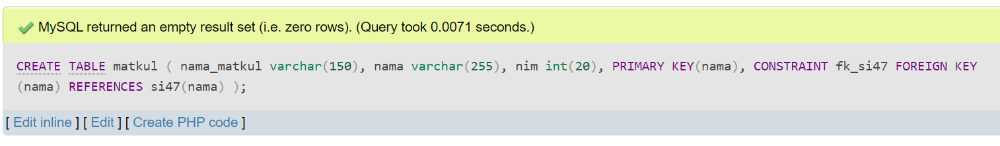
        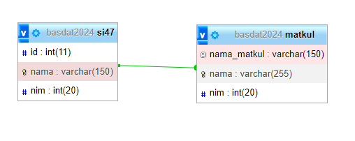
        </p>

- ### **ALTER TABLE**
    - #### **ADD COLUMN**
        <div align='justify'>
        Add Column digunakan untuk membuat kolom pada sebuah tabel dengan perintah :
        </div>
        <br>

        ```sql
        ALTER TABLE nama_tabel 
        ADD nama_kolom tipe_data;
        ```
        Contoh : 
        <p align="center">
        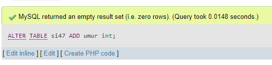
        </p>
        
    - #### **ADD MULTIPLE COLUMN**
        <div align='justify'>
        Add Multiple Column digunakan untuk menambahkan beberapa kolom pada sebuah tabel dengan perintah :
        </div>
        <br>

        ```sql
        ALTER TABLE nama_tabel 
        ADD nama_kolom1 tipe_data, 
        ADD nama_kolom2 tipe_data;
        ```
        Contoh : 
        <p align="center">
        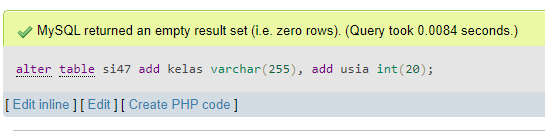
        </p>

    - #### **ADD FOREIGN KEY**
        <div align='justify'>
        Add Foreign Key digunakan untuk menambahkan <i>Foreign Key</i> pada sebuah tabel dengan perintah :
        </div>
        <br>

        ```sql
        ALTER TABLE nama_tabel
        ADD CONSTRAINT fk_nama_kolom
        FOREIGN KEY (nama_kolom) 
        REFERENCES tabel_parent (nama_kolom);
        ```
        Contoh : 
        <p align="center">
        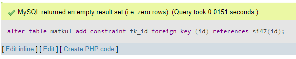
        </p>


    - #### **MODIFY COLUMN**
        <div align='justify'>
        Modify Column digunakan untuk mengubah tipe data kolom pada sebuah tabel dengan perintah :
        </div>
        <br>

        ```sql
        ALTER TABLE nama_tabel
        MODIFY nama_kolom tipe_data;    
        ```
        Contoh : 
        <p align="center">
        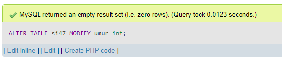
        </p>


    - #### **MODIFY MULTIPLE COLUMN**
        <div align='justify'>
        Modify Multiple Column digunakan untuk mengubah tipe data beberapa kolom pada sebuah tabel dengan perintah : 
        </div>
        <br>

        ```sql
        ALTER TABLE nama_tabel
        MODIFY nama_kolom1 tipe_data,
        MODIFY nama_kolom2 tipe_data;
        ```
        Contoh : 
        <p align="center">
        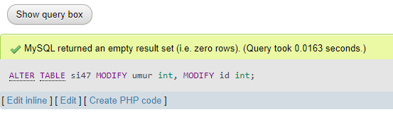
        </p>

    - #### **RENAME COLUMN**
        <div align='justify'>
        Rename Column digunakan untuk mengubah nama kolom pada sebuah tabel dengan perintah :
        </div>
        <br>

        ```sql
        ALTER TABLE nama_tabel
        RENAME COLUMN nama_kolom_awal
        TO nama_kolom_akhir; 
        ```
        Contoh : 
        <p align="center">
        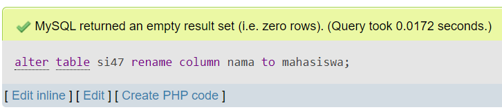
        </p>

    - #### **RENAME TABLE**
        <div align='justify'>
        Rename Table digunakan untuk mengubah nama tabel dengan perintah :
        </div>
        <br>

        ```sql
        ALTER TABLE nama_tabel
        RENAME TO nama_tabel_baru;
        ```
        Contoh :
        <p align="center">
        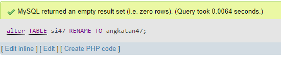
        </p>

- ### **DROP**
    - #### **DROP COLUMN**
        <div align='justify'>
        Drop Column digunakan untuk menghapus kolom pada sebuah tabel dengan perintah :
        </div>
        <br>

        ```sql
        ALTER TABLE nama_tabel
        DROP COLUMN nama_kolom;
        ```
        Contoh : 
        <p align="center">
        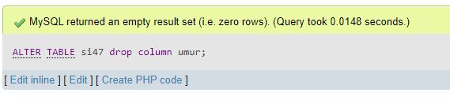
        </p>

    - #### **DROP FOREIGN KEY**
        <div align='justify'>
        Drop <i>Foreign Key</i> digunakan untuk menghapus <i>Foreign Key</i> pada sebuah tabel dengan perintah :
        </div>
        <br>

        ```sql
        ALTER TABLE nama_tabel
        DROP FOREIGN KEY fk_kolom;
        ```
        Contoh : 
        <p align="center">
        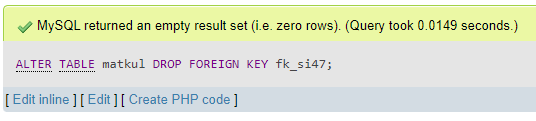
        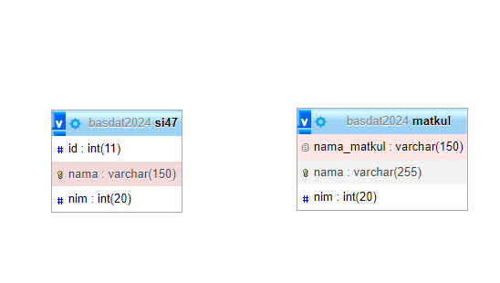
        </p>

    - #### **DROP TABLE**
        <div align='justify'>
        Drop Table digunakan untuk menghapus sebuah tabel pada query SQL dengan perintah :
        </div>
        <br>

        ```sql
        DROP TABLE nama_tabel;
        ```
        Contoh : 
        <p align="center">
        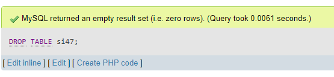
        </p>

    - #### **DROP DATABASE**
        <div align='justify'>
        Drop database digunakan untuk menghapus <i>database</i> yang telah dibuat dengan perintah : 
        </div>
        <br>

        ```sql
        DROP DATABASE nama_database;
        ```
        Contoh : 
        <p align="center">
        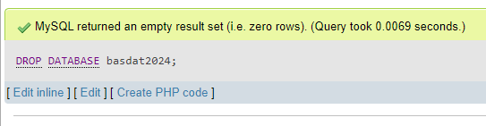
        </p>

---
## ***MySQL Constraint***
<div align='justify'>
&nbsp;&nbsp;&nbsp;<b><i>MySQL Constraint</i></b> digunakan untuk menentukan aturan yang membatasi nilai atau data apa saja yang dapat disimpan pada kolom di dalam tabel <i>database</i> MySQL. Batasan ini digunakan untuk membatasi jenis data yang dapat dimasukkan ke dalam tabel. MySQL Constraint dideklarasikan pada saat membuat tabel.</div> <br>

Berikut adalah beberapa <i>constraint</i> yang sering digunakan di dalam tabel MySQL :

1.  #### **NOT NULL**
    <div align='justify'>
    Dalam MySQL, NOT NULL <i>constraint</i> memungkinkan untuk menentukan bahwa kolom tidak dapat berisi nilai NULL. MySQL NOT NULL dapat digunakan pada saat CREATE dan ALTER tabel.
    </div>

2.  #### **UNIQUE**
    <div align='justify'>
    UNIQUE <i>constraint</i> di MySQL memastikan bahwa setiap nilai dalam kolom bersifat unik atau tidak boleh duplikat. Dengan <i>constraint ini</i>, duplikasi data yang tidak diinginkan dapat dicegah. Selain itu, UNIQUE <i>constraint</i> berfungsi untuk memastikan integritas sebuah data.
    </div>
    
3.  #### **PRIMARY KEY**
    <div align='justify'>
    PRIMARY KEY adalah constraint yang memberlakukan suatu tabel untuk menerima data unik untuk kolom tertentu.  PRIMARY KEY mengidentifikasi setiap baris dalam tabel dengan membuat indeks unik dan dapat membantu untuk mengakses tabel lebih cepat.  
    </div>
    
4.  #### **FOREIGN KEY**
    <div align='justify'>
    FOREIGN KEY pada MySQL digunakan untuk menciptakan tautan antara dua tabel dengan satu kolom khusus dari kedua tabel. Kolom yang ditentukan dalam satu tabel harus berupa PRIMARY KEY dan dirujuk oleh kolom tabel lain yang dikenal sebagai FOREIGN KEY.
    </div>
    
5.  #### **CHECK**
    <div align='justify'>
    CHECK merupakan <i>constraint</i> yang mengontrol nilai-nilai di dalam kolom terkait. CHECK <i>constraint</i> menentukan apakah nilai tersebut valid atau tidak dari ekspresi logis.
    </div>
    
6.  #### **DEFAULT**
    <div align='justify'>
    Dalam tabel MySQL, setiap kolom harus berisi nilai (termasuk NULL). Saat memasukkan data ke dalam tabel, jika tidak ada nilai yang diberikan ke kolom, maka kolom akan mendapatkan nilai yang ditetapkan sebagai DEFAULT.
    </div>
    
7.  #### **INDEX**
    <div align='justify'>
    INDEX <i>constraint</i> digunakan untuk membuat index pada satu atau beberapa kolom di dalam tabel. INDEX mempercepat pencarian dan pengurutan data dalam tabel. Index dapat dibuat pada kolom yang memiliki kardinalitas tinggi, artinya banyak nilai unik yang terdapat pada kolom tersebut.
    </div>
    
8.  #### **AUTO INCREMENT**
    <div align='justify'>
    AUTO INCREMENT <i>constraint</i> digunakan untuk membuat kolom yang nilainya otomatis bertambah ketika sebuah baris baru dimasukkan ke dalam tabel. Biasanya, AUTO INCREMENT digunakan pada kolom Primary Key untuk menghasilkan nilai yang unik dan increment secara otomatis.
    </div>
    
9.  #### **ON DELETE dan ON UPDATE**
    <div align='justify'>
    ON DELETE dan ON UPDATE <i>constraint</i> digunakan untuk menetapkan tindakan yang akan diambil pada baris di tabel yang memiliki referensi ke baris di tabel lain ketika baris itu dihapus atau di-update. Ada empat tindakan yang dapat dilakukan, yaitu RESTRICT, CASCADE, SET NULL, dan NO ACTION.
    </div>
    
10. #### **UNIQUE INDEX**
    <div align='justify'>
    UNIQUE INDEX <i>constraint</i> digunakan untuk membatasi nilai yang unik pada satu atau beberapa kolom di dalam tabel. UNIQUE INDEX memastikan bahwa tidak ada dua baris dengan nilai yang sama di kolom tersebut.
    </div>
    
11. #### **NOT NULL WITH DEFAULT**
    <div align='justify'>
    NOT NULL WITH DEFAULT <i>constraint</i> digunakan untuk membatasi nilai yang tidak dapat null pada kolom dan memberikan nilai default ketika nilai tidak diberikan saat memasukkan data baru ke dalam tabel.
    </div>
    
12. #### **VIRTUAL**
    <div align='justify'>
    VIRTUAL <i>constraint</i> digunakan untuk membuat kolom virtual yang dihasilkan dari ekspresi atau perhitungan pada kolom lain di dalam tabel. Kolom virtual tidak disimpan di dalam tabel tetapi dihasilkan saat kolom tersebut ditampilkan.
    </div>

<div align='justify'>
&nbsp;&nbsp;&nbsp;Semua jenis constraint di atas dapat digunakan pada saat membuat atau mengubah struktur tabel di MySQL. Penggunaan constraint yang tepat dapat meningkatkan integritas data di dalam tabel dan memastikan bahwa data yang dimasukkan ke dalam tabel selalu valid dan akurat.</div>

---
## ***Referential Integrity Constraint***
<div align='justify'>
&nbsp;&nbsp;&nbsp;<b><i>Referential Integrity Constraint</i></b> merupakan aturan dalam basis data yang bertujuan untuk memastikan bahwa relasi antara dua tabel tetap konsisten. <i>Constraint</i> ini memastikan bahwa setiap nilai dalam kolom yang digunakan sebagai foreign key dalam sebuah tabel harus sesuai dengan nilai yang ada dalam kolom primary key di tabel yang terkait. Terdapat 2 macam tabel yaitu tabel child dan tabel parent. Aturan referential integrity biasanya digunakan jika terjadi proses modifikasi data seperti insert, update, dan delete.</div><br>

Berikut merupakan beberapa aturan dalam Referential Integrity *Constraint* :

1. #### Aturan Update
    Aturan ini berlaku pada saat proses modifikasi di parent table :

    - CASCADE 	: Pembaruan sebuah baris data diikuti dengan pembaruan baris data pada child table yang direlasikan.

    - RESTRICT 	: Mencegah proses pembaruan data jika terdapat baris data di child table yang direlasikan. 

    - IGNORE 	: Mengabaikan referensi. Boleh memperbarui data pada parent, tapi tidak memperbarui data yang berelasi pada child table.

2. #### Aturan Delete
    Aturan ini berlaku pada proses modifikasi di parent table.

    - CASCADE	: Menghapus seluruh baris data pada child table yg terselesaikan. 

    - RESTRICT 	: Mencegah penghapusan jika terdapat baris data yang berelasi pada child table. 

    - IGNORE 	: Mengabaikan referensi. Boleh menghapus data, dan tidak ada efeknya bagi child table

3. #### Aturan Insert
    Aturan ini berlaku pada proses menambahkan data di parent table. 

    - RESTRICT 	: Tidak boleh menambah data pada child table, jika nilai yang dimasukkan pada kolom yang berelasi tidak terdapat pada parent tabelnya. 

    - IGNORE 	: Mengabaikan referensi. Boleh menambah data pada child, walaupun nilai yang dimasukkan pada kolom yang berelasi tidak terdapat pada parent tabel.

    